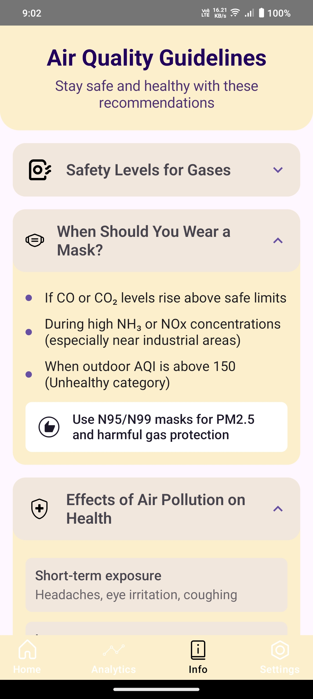

# 🌫️ AirSage AI

> A smart air quality monitoring app powered by real-time Firebase integration and designed with Jetpack Compose.  
> Paired with a custom **hardware sensor module**, AirSage AI provides instant, location-based pollution updates to users.

---

## 📦 Project Overview

**AirSage AI** is an Android application that visualizes live gas readings (CO, CO₂, NH₃, NOx, etc.) transmitted from a physical hardware device. The hardware sensors push data continuously to **Firebase Realtime Database**, which is instantly reflected in the app using reactive UI patterns.

Designed with **Figma** for clean, modern UI and built with the latest Android tech stack, this project combines IoT + mobile + cloud into one seamless ecosystem.

---

## ✨ Features

- 📍 **Live Location Tracking**  
  Automatically fetches your location to show localized air quality readings.

- 📊 **Real-Time AQI (Air Quality Index)**  
  Converts raw gas sensor values into meaningful AQI metrics with thresholds and visual cues.

- 🔔 **Smart Notifications**  
  Notifies users when the air quality falls into unhealthy zones.

- 📚 **Info & Guidelines**  
  Dedicated page to educate users on pollution threats and safety measures (e.g., when to wear a mask).

---

## 🖼️ Screenshots

<table>
  <tr>
    <td align="center"></td>
    <td align="center"></td>
  </tr>
</table>

> 📌 Replace the above placeholders with real screenshots from your app (Figma → Export → PNG).

---

## 🧱 Tech Stack

- 🖌️ **Jetpack Compose** – Modern UI toolkit for Android
- 🔥 **Firebase Realtime Database** – Real-time data sync with hardware
- 📍 **Google Maps & Location Services** – Display AQI by user’s location
- 🔔 **Accompanist Permissions** – Runtime permission handling
- 🧠 **WorkManager & DataStore** – Background processing & user preferences
- 🎨 **Figma** – Design-first approach to UI prototyping

---

## 🧩 Key Dependencies

<details>
<summary>Click to view all</summary>

```kotlin
// Navigation
implementation("androidx.navigation:navigation-compose:2.8.9")

// DataStore
implementation("androidx.datastore:datastore-preferences:1.1.4")

// Background tasks
implementation("androidx.work:work-runtime-ktx:2.10.0")

// Maps & location
implementation("com.google.maps.android:maps-compose:6.4.1")
implementation("com.google.android.gms:play-services-location:21.3.0")

// Compose runtime
implementation("androidx.lifecycle:lifecycle-runtime-compose:2.8.7")

// Permissions
implementation("com.google.accompanist:accompanist-permissions:0.34.0")

// Firebase Realtime Database
implementation(libs.firebase.database)

// Jetpack Compose UI, Material3, Testing, etc.
implementation(libs.androidx.material3)
```
</details>
