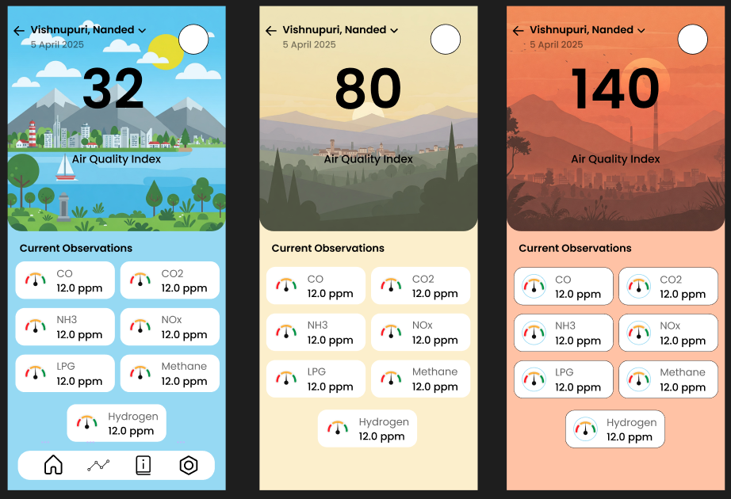

# 🌫️ AirSage AI

> A smart and intuitive Android app built with Jetpack Compose and Firebase to monitor air quality, provide health guidelines, and alert users in real-time.

---

## ✨ Features

- 📍 **Live Location Tracking**  
  Automatically fetches your location to show localized air quality readings.

- 📊 **Real-Time Air Quality Index (AQI)**  
  Converts raw gas sensor data into meaningful AQI values using custom logic.

- 🔔 **Notification Alerts**  
  Sends smart alerts based on air quality and danger levels.

- 📚 **Info & Guidelines Page**  
  Informs users about pollution threats and safety measures like mask usage.

---

## 📸 Screenshots

<table>
  <tr>
    <td align="center">
      
    </td>
    <td align="center">
      
    </td>
    <td align="center">
      
    </td>
  </tr>
</table>

> 📌 Replace the images in `assets/` with actual screenshots from your app.

---

## 🧱 Built With

- 🧑‍🎨 **Jetpack Compose** – Modern declarative UI toolkit
- 🌐 **Firebase Realtime Database** – Sync air data in real-time
- 📍 **Google Maps & Location Services** – For live air data by location
- 🔧 **WorkManager** – Background work & data sync
- 🎛️ **DataStore** – Lightweight user preferences storage
- 🔔 **Accompanist Permissions** – Runtime permission handling

---

## 🧩 Dependencies

<details>
<summary>Click to view all</summary>

```kotlin
// Navigation
implementation("androidx.navigation:navigation-compose:2.8.9")

// DataStore
implementation("androidx.datastore:datastore-preferences:1.1.4")

// Background tasks
implementation("androidx.work:work-runtime-ktx:2.10.0")

// Maps & location
implementation("com.google.maps.android:maps-compose:6.4.1")
implementation("com.google.android.gms:play-services-location:21.3.0")

// Compose runtime
implementation("androidx.lifecycle:lifecycle-runtime-compose:2.8.7")

// Permissions
implementation("com.google.accompanist:accompanist-permissions:0.34.0")

// Firebase
implementation(libs.firebase.database)

// Compose UI, Material3, JUnit, Tooling...
// (Add the rest as in your `build.gradle.kts`)
